# Знакомство с веб-технологиями (семинары)

## Урок 1. Веб-технологии: вчера, сегодня, завтра

### Задача: на основе сайта yandex.ru:
- Определите, на каком протоколе работает сайт.
- Проанализируйте структуру страницы сайта.
- Внесите не менее 10 изменений на страницу с помощью инструмента разработчика и представьте скриншоты было/стало.
- Задание по желанию необязательное - Создайте прототип низкой детализации (дополнительное задание, если на семинаре дошли до задания №8).

Критерии оценивания:
- Слушатель корректно определил, на каком протоколе работает сайт.
- Слушатель внес не менее 10 изменений на страницу с помощью инструмента разработчика и описал внесенные изменения.
- Слушатель создал прототип низкой детализации.

**Задача 1.**

Сайт работает на протоколе https (защищенный).Определяем при помощи просмотра полного пути ссылки.
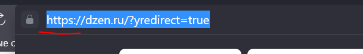

**Задача 2.**

Структура сайта:
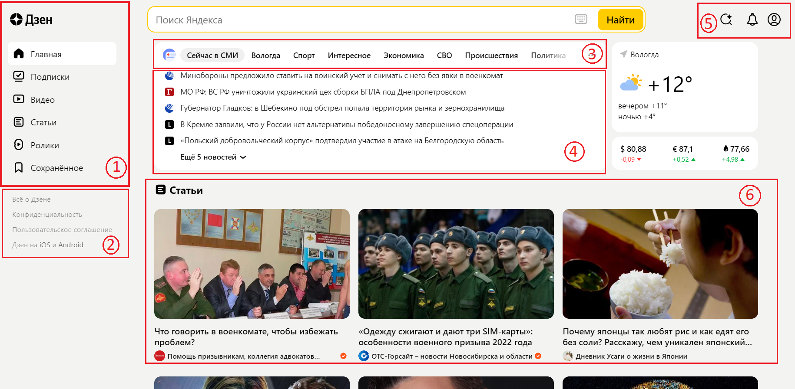

1. Header
2. Footer
3. Header
4. Content
5. Зона виджетов
6. Content

**Задача 3.**

Изменения на странице Yandex.ru

1. Переименование заголовков

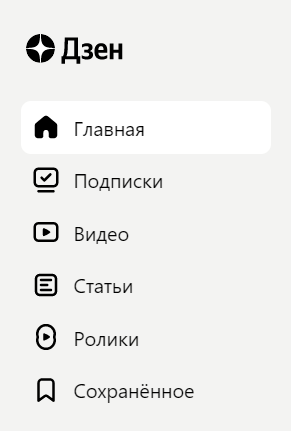
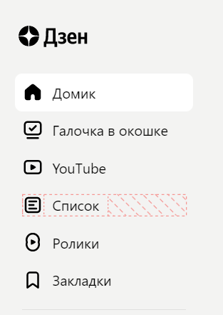

2. Удаление кнопки "Главная"

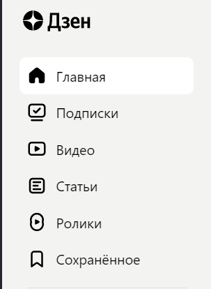
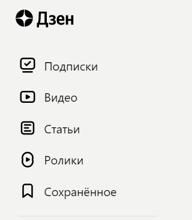

3. Удаление статьи

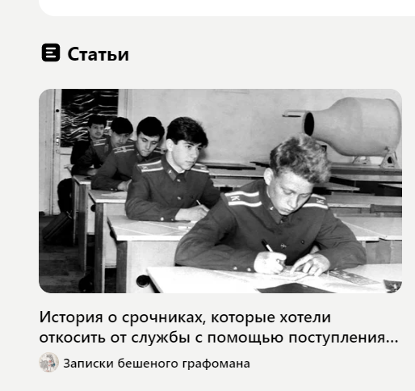

4. Замена картинки на другую

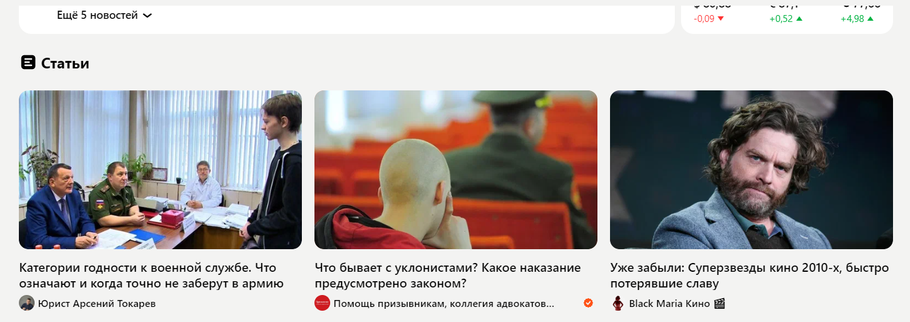
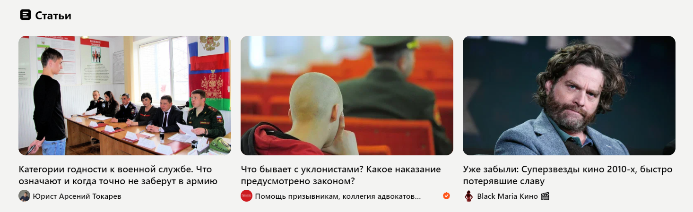

5. Замена цвета фона строк

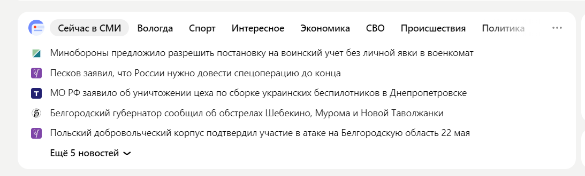
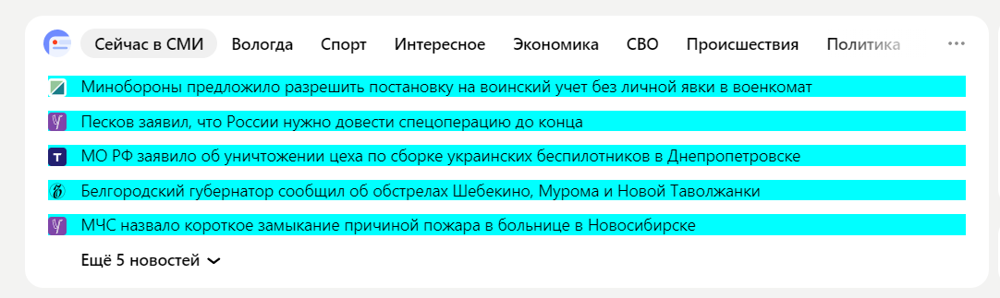

6. Замена цвета текста

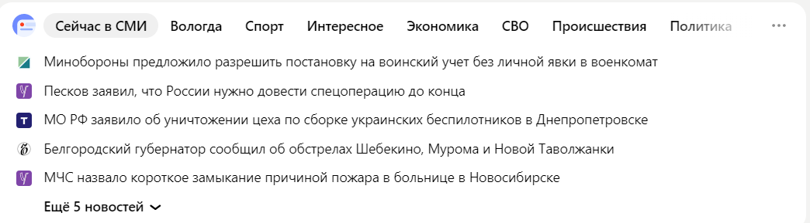
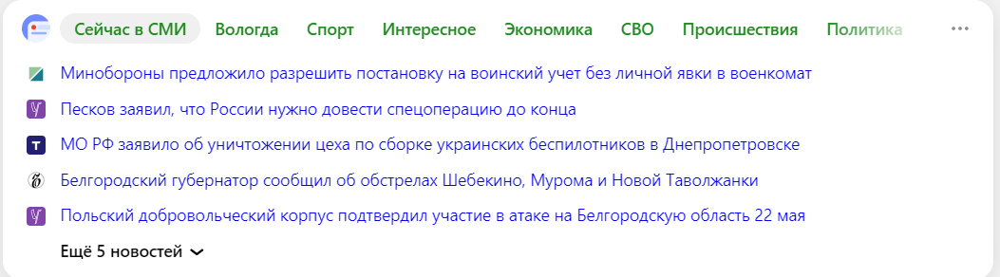

7. Замена цвета фона страницы

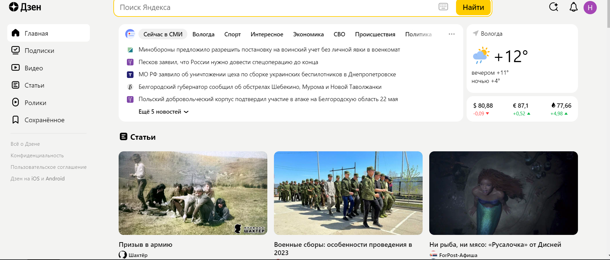
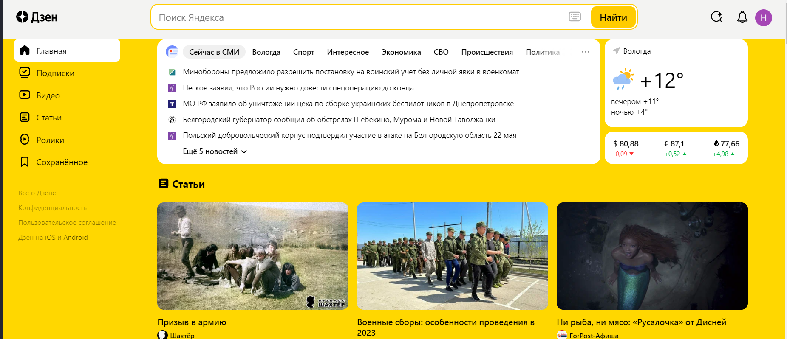

8. Изменение размера текста и высоты строки

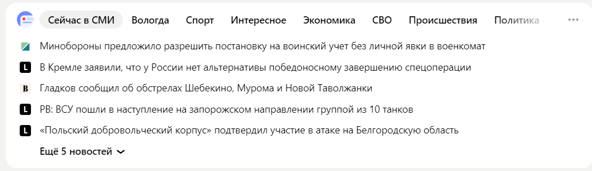
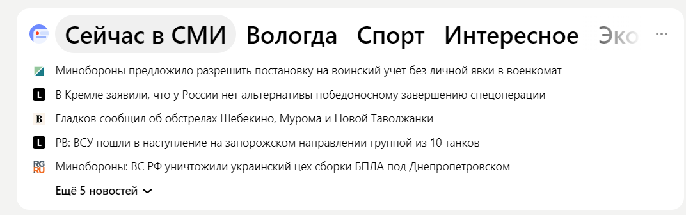

9. Изменение размера значка и жирности текста

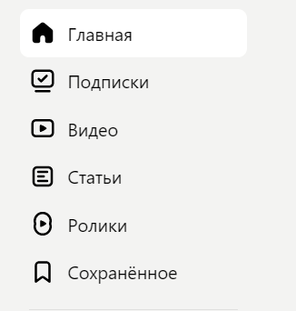
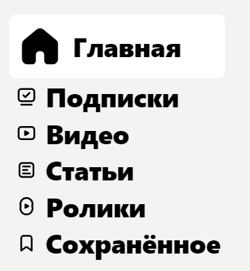

10. Удаление функции "Поиск Яндекса"

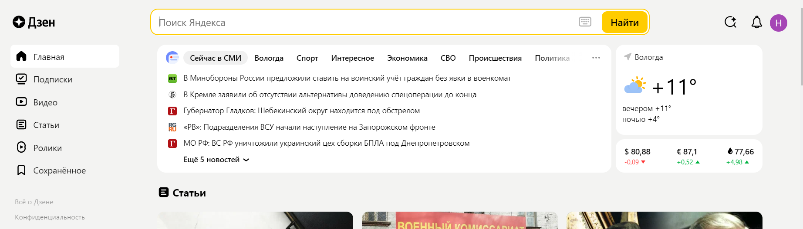
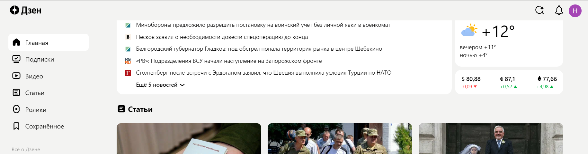

**Задача 4.**

Прототип низкой детализации сайта.

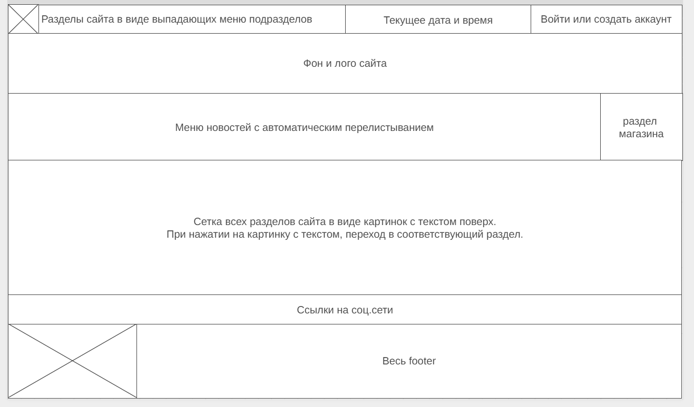